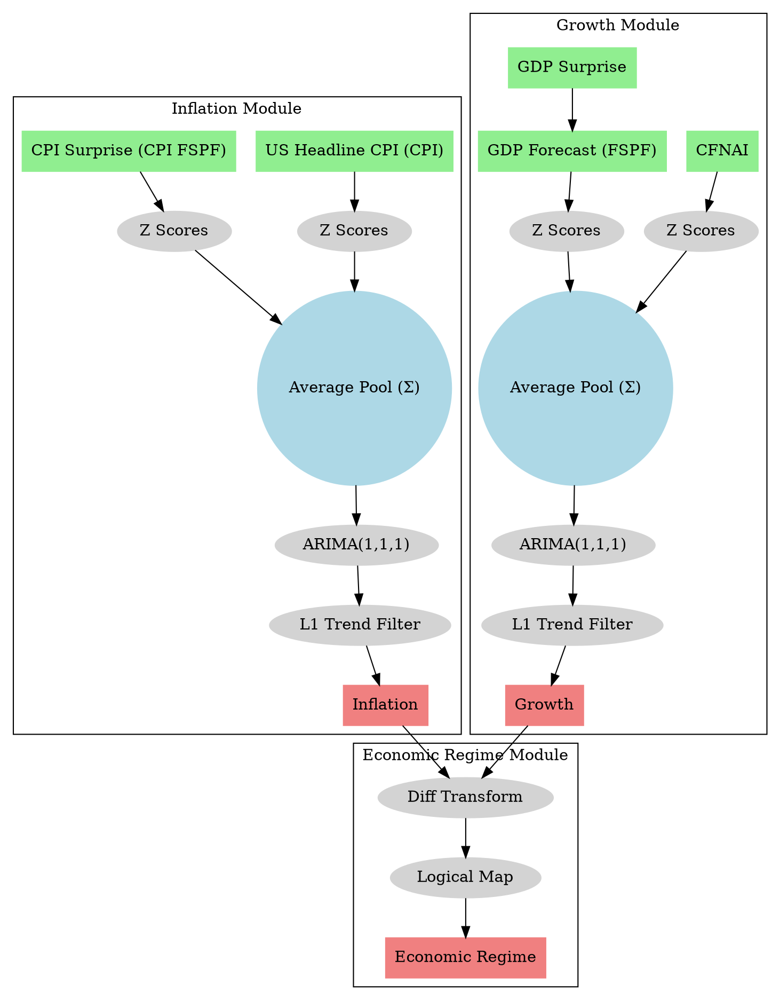
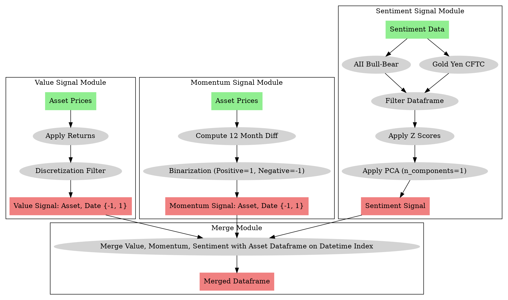

# L2 Exercise

| Module                    | Sub-components                                                   | Time  | Notes                           |
|---------------------------|------------------------------------------------------------------|-------|---------------------------------|
| **Macro Module**          | Inflation Component, Growth Component, Economic Regime Component | 5-8h    | Develop inflation and growth pipeline to economic regime. Preprocessing, indexing, z scores  |
| **External Signals Module** | Value Signal Component, Momentum Component, Sentiment Component, Merge | 5-8h    | Integrate various signals from different sources     |
| **Portfolio Optimization Module** | -                                                        | 20-25h    | Optimize the portfolio. Aggregate everything together and compute optimal portfolio as well as optimal portfolio performance.          |

**Best case scenario**: 30h ~ 225 - 50 = 175 €
**Worst case scenario**: 41h ~ 307.5 - 50 = 257.5 €
**Most likely**: I would say around 35ish h. The macro module and external signals are clear to me. The optimization isn't so clear, there is a lot of "cheating" he does to adjust his data to achieve the results he wants. These transforms aren't clear in his thesis, so I assume its cheating :P

**Expectations**: The system should be build and you should be able to reproduce the notebook with your own assets.

- Sentiment and macro algorithm will be fixed
- Limited visualizations (the visualizations should be only to help us trouble shoot), we can build better visualizations after
- Data comes from excel sources
- A lot of tweaking in the optimization will be needed: the data is trimmed using quantiles, expected returns from mean historical values, the weight of each technical indicator, etc. These weights are not clear to me and they seem arbitrary.

**Outputs**: Weights of optimal portfolio; return, volatility and sharpe

Once this is done, we can add/change features at your request incrementally.

This diagram now uses:
- Light green for input nodes.
- Light coral for output nodes.
- Light grey ellipses for operations.
- A light blue circle for the Average Pool.

